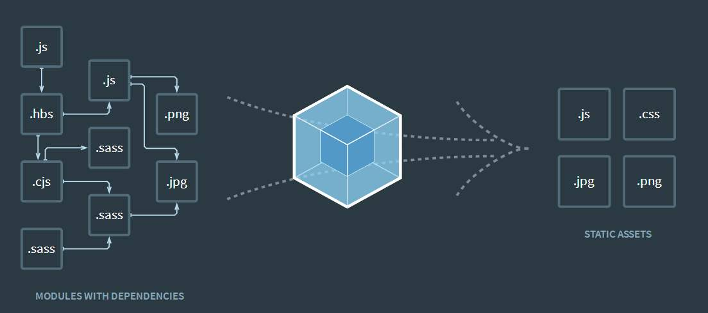

# `Webpack` 学习笔记



​		**`webpack`** 是一个用于现代`Webpack`应用程序的***静态模块打包工具***。当 `webpack` 处理应用程序时，它会在内部构建一个 [依赖图(dependency graph)](https://webpack.docschina.org/concepts/dependency-graph/)，此依赖图对应映射到项目所需的每个模块，并生成一个或多个 *bundle*。在`Webpack`内部一切皆模块，专注于构建模块化项目。

## 为什么选择`Webpack`

前端项目构建及工程化的工具不只有`Webpack`，但是我们为什么要选择`Webpack`，而且人人必会？

这里从两个角度分析

### 面向项目

​		我们开发的项目中包含内容：框架、`ES6`、`Javascript`、`CSS`、`HTML`、图片等等内容，但是项目的源代码无法直接运行，必须通过转换才可以正常运行。打包转换需要做的工作：

- **代码转换**。将ES6转换为`Javascript`、将`LESS`转换为`CSS`。
- **文件优化**。压缩`Javascript`、`CSS`、`HTML`，图片压缩转化。
- **代码分割**。提取公共代码，将首屏不需要的代码进行异步加载。
- **模块合并**。模块化项目中有时需要将模块进行分类合并在一个文件。
- **自动刷新**。监听本地源代码变化，自动重新构建、刷新浏览器。
- **代码校验**。在代码提交前校验代码是否符合开发规范。能否通过测试、跑通。
- **自动发布**。更新代码后，自动构建出线上代码并传输给发布系统。

### 面向工具

​		构建工具多种多样，但是各有特点、优劣。
- `Gulp`
  - 最大特点是引入流的概念，提供一系列插件处理流，流可以在插件间流转
  - 有点是好用又灵活
  - 问题是需要进行很多配置，无法做到开箱即用
- `Fis3`
  - 国产货，功能强大，开箱即用。
  - 不再维护，不支持新版的`Node.js`
- `Webpack`
  - 专注处理模块化项目，开箱即用，一步到位
  - 强大的Plugin、Loader，使其可以应对各种复杂情况
  - 可扩展性强，社区庞大活跃
  - 满足多样使用场景
  - 缺点是只适用于模块化开发的项目
- `Rollup`
  - 专注于ES6模块打包，可以针对ES6源码进行`Tree Shaking`，去除无用代码。
  - 配置和使用简单
  - 生态链不完善，体验不如`Webpack`
  - 不支持`Code Spliting`，好处是打包出的代码没有`Webpack`那段模块的加载、执行和缓存的代码
  - 适用于打包`Javascript`库，如`Vue`，因为它打包出的代码更小更快。


> ​		在选择一个构建工具时，应该先以项目为出发点，结合项目需求选择构建工具，如果我们是要开发一个Web应用，还是`Javascript`库，如果是Web应用最好选用`Webpack`，如果是后者建议选用`Rollup`。

## 安装`Webpack`

- 首先创建一个文件目录，初始化 `npm init`，然后 [在本地安装 webpack](https://webpack.docschina.org/guides/installation#local-installation)，接着安装 `webpack-cli`（此工具用于在命令行中运行 `webpack`）：

```js
mkdir webpack-demo
cd webpack-demo
npm init -y
npm install webpack webpack-cli --save-dev
```

- 根目录下新建一个`webpack.config.js`文件，`Webpack`在执行构建时默认会从这个文件中读取配置

```js
const path = require('path');

module.exports = {
  entry: './src/index.js',
  output: {
    filename: 'main.js',
    path: path.resolve(__dirname, 'dist'),
  },
};
```

接下来我们就能继续搞事情了。

## 熟悉`Webpack`

### `Webpack`核心概念

- **`Entry`：入口**。`Webpack`执行构建的第一步将从Entry开始搜寻及递归解析出所有入口依赖的模块。
- **`Module`：模块**。在`Webpack`里一切皆是模块，一个模块对应一个文件。`Webpack`会从配置的Entry开始递归找出所有依赖的模块。本文的第一张图象形的展示了这个过程（官网的更形象🙊）
- **`Chunk`：代码块**。一个`Chunk`由多个模块组合而成，用于代码合并和分割。
- **`Loader`：模块转换器**。用于将模块的原内容按照需求转换成新内容。
- **`Plugin`：扩展插件**。在`Webpack`构建流程中的特定时机（生命周期钩子）注入扩展逻辑，来改变构建结果或做我们想做的事情。
- **`Output`：输出结果**。在`Webpack`经过一系列处理并得出最终想要的代码后输出的结果。

### `Entry`

- 书写方式：
  - 字符串：`'./app/entry'`
  - 数组：`[ './app/entry1',  './app/entry2' ]`
  - 对象：`{  a: './app/entry-a',  b: ['./app/entry-b1', './app/entry-b2'] }`
- 单页应用为字符串形式，如果为多页应用或者需要与第三方库进行分离，需要使用数组或者对象形式

```js
// webpack.config.js
module.exports = {
  //...
  entry: {
    home: './home.js',
    about: './about.js',
    contact: './contact.js'
  }
};
```

### `Output`

output配置如何输出最终想要的代码，为`Object`形式。

- `filename`，输出的文件名，为String类型，`filename: 'bundle.js'`，`filename: '[name].js'`
- `chunkFilename`，决定了非初始（non-initial）`chunk` 文件的名称。与`filename`类似，但是只用于指定在运行过程中生成的Chunk在输出是的文件名称，常见使用场景：使用`CommonChunkPlugin`、使用`import('path/to/module')`动态加载等。
- `path`，配置输出文件存放在本地的目录，必须是`string`类型的绝对路径，`path: path.resolve(__dirname, 'dist_[hash]')`
- `publicPath`，用于配置发布到线上资源的URL前缀，为string类型，默认值是空字符串，使用相对路径。有时候需要将一些资源文件上传到CDN服务上，以加快页面的打开速度。`publicPath: 'https://cdn.example.com/assets/'`
- `crossOriginLoading`，通过JSONP的方式实现代码块的异步加载。

```js
// webpack.config.js
module.exports = {
  //...
  output: {
    library: 'someLibName',
    libraryTarget: 'umd',
    filename: 'someLibName.js',
    auxiliaryComment: 'Test Comment'
  }
};
```

### `Module`

- 配置`Loader`。`rules`配置模块的读取和解析规则，通常用来配置`Loader`。其类型是一个对象数组，数组里的每一个对象都描述如何处理部分文件。配置Rules:
  - 条件匹配：通过`test`、`include`、`exclude`三个配置项来选中`Loader`要应用规则的文件。
  - 应用规则：对选中的文件通过use配置项来应用Loader，可以之应用一个`Loader`或者按照从后往前的顺序应用一组`Loader`，同时可以分别向`Loader`传入参数。
  - 充值顺序：一组`Loader`的执行顺序默认是从右到左执行，通过`Enforce`选项可以将其中一个`Loader`的执行顺序放到最前或者最后。

```js
// webpack.config.js
module.exports = {
  module: {
    rules: [
      {
        test: /\.s[ac]ss$/i,
        use: [
          // 将 JS 字符串生成为 style 节点
          'style-loader',
          // 将 CSS 转化成 CommonJS 模块
          'css-loader',
          // 将 Sass 编译成 CSS
          'sass-loader',
        ],
      },
    ],
  },
}
```

- `noParse`配置项可以让`webpack`忽略对部分没采用模块化的文件的递归解析和处理，提高构建性能。

```js
module.exports = {
  //...
  module: {
    noParse: /jquery|lodash/,  
    noParse: (content) => /jquery|lodash/.test(content)
  }
};
```

- `parsers`可以更细粒度的配置哪些模块语法被解析、哪些不被解析，可以精确到语法层面。
  - 将选项设置为 `false`，将禁用解析器。
  - 将选项设置为 `true`，或不修改将其保留为 `undefined`，可以启用解析器。

```js
module.exports = {
  //...
  module: {
    rules: [
      {
        //...
        parser: {
          amd: false, // 禁用 AMD
          commonjs: false, // 禁用 CommonJS
          system: false, // 禁用 SystemJS
          harmony: false, // 禁用 ES2015 Harmony import/export
          requireInclude: false, // 禁用 require.include
          requireEnsure: false, // 禁用 require.ensure
          requireContext: false, // 禁用 require.context
          browserify: false, // 禁用特殊处理的 browserify bundle
          requireJs: false, // 禁用 requirejs.*
          node: false, // 禁用 __dirname, __filename, module, require.extensions, require.main, 等。
          node: {...}, // 在模块级别(module level)上重新配置 [node](/configuration/node) 层(layer)
          worker: ["default from web-worker", "..."] // 自定义 WebWorker 对 JavaScript 的处理，其中 "..." 为默认值。
        }
      }
    ]
  }
}
```

### `Resolve`

`Resolve`配置`Webpack`如何寻找模块所对应的文件

- `alias`配置项通过别名来将原导入路径映射成一个新的导入路径。

```js
const path = require('path');

module.exports = {
  //...
  resolve: {
    alias: {
      Utilities: path.resolve(__dirname, 'src/utilities/'),
      Templates: path.resolve(__dirname, 'src/templates/'),
    },
  },
};
```

- `mainFields`，有一些第三方模块会针对不同的环境提供几份代码。`mainFields`用来决定优先采用哪份代码。`mainFields: ['browser', 'module', 'main']`
- `extensions`，在导入的语句没有带文件后缀时，`Webpack`会自动带上后缀去尝试访问文件是否存在。
  - 问题：影响构建速度

```js
module.exports = {
  //...
  resolve: {
    extensions: ['.wasm', '.mjs', '.js', '.json'],
  },
};
```

- `modules`。告诉 `webpack` 解析模块时应该搜索的目录，默认为`'node_modules'`，但是有时我们会从其他目录下引用模块。

```js
const path = require('path');

module.exports = {
  //...
  resolve: {
    modules: [path.resolve(__dirname, 'src'), 'node_modules'],
  },
};
```

- `enforceExtension`配置为true，则所有导入语句都必须带文件后缀，`import './foo.js'`

### `DevServer`

- `hot`配置是否启用模块热替换功能。
- `headers`配置项可以在HTTP响应中注入一些HTTP响应头。
- `host`配置项用于配置`DevServer`服务监听的地址。
- `port`配置项用于配置`DevServer`服务器监听的端口，默认8080
- `proxy`配置项用来启用代理
- `inline`，`DevServer`的实时预览功能依赖一个注入页面里的代理客户端，去接收来自`DevServer`的命令并负责刷新网页的工作，inline用于配置是否将代理客户端自动注入将运行在页面中的`Chunk`里，默认注入，
- `https`配置项用来启用HTTPS服务，会自动生成一份HTTPS证书，也可以自己配置。
- `compress`配置项用来启用`Gzip`压缩

```js
var path = require('path');

module.exports = {
  //...
  devServer: {
     proxy: {
      '/api': 'http://localhost:3000'
    },
    contentBase: path.join(__dirname, 'dist'),
    compress: true,
    hot: true,
    port: 9000,
    headers: {
      'X-Custom-Foo': 'bar'
    },
    host: '0.0.0.0'
  }
};
```

### `Plugin`

`Plugin`配置项为一个数组，数组中的每一项都是一个要使用的`Plugin`的实例，`Plugin`的难点在于掌握`Plugin`提供的配置项。

```js
webpack.config.js
var webpack = require('webpack');
// 导入非 webpack 自带默认插件
var DashboardPlugin = require('webpack-dashboard/plugin');

// 在配置中添加插件
module.exports = {
  //...
  plugins: [
    new webpack.IgnorePlugin(/^\.\/locale$/, /moment$/),
   // 编译时(compile time)插件
    new webpack.DefinePlugin({
      'process.env.NODE_ENV': '"production"',
    }),
   // webpack-dev-server 强化插件
    new DashboardPlugin(),
    new webpack.HotModuleReplacementPlugin(),
  ]
};
```

上面已经把几个重要的概念的相关配置熟悉了下，下面开始干正事：配置。

## 配置`Webpack`

### 切入角度

- 项目
  - 使用什么框架
  - 项目**构建目标**
- 开发环境
  - 更好的**开发体验**
  - 更快的刷新响应速度
  - 更好的调试体验
- 生产环境
  - 更小的代码体积
  - 更小的宽带流量
  - 更好的**用户体验**

### 配置

- `Babel`，将新的ES6代码转为ES5代码，为新的API注入`polyfill`。
- `scss-loader`，`css-loader`，`style-loader`。将`scss`转换为`css`。
- `PostCSS`为`CSS`属性自动添加浏览器前缀，使用最新的`CSS`语法。
- `vue-loader`，解析和转化.`vue`文件，提取其中的`script、style、template`，再将他们分别交给对应的Loader处理。
- `file-loader`可以将`javascript`和`css`中导入图片的语句替换为正确的地址，同时将文件输出到对应的位置
- `Source Map`，`devtool`选项用于控制是否生成，以及如何生成 `source map`。选择一种 [source map](http://blog.teamtreehouse.com/introduction-source-maps) 格式来增强调试过程。不同的值会影响到**构建(build)和重新构建(rebuild)的速度**。此处应该参考[DevTool配置项](https://webpack.docschina.org/configuration/devtool/)对开发环境或者生产环境进行配置。

### 优化

- ⭐**缩小文件搜索范围**
  - 优化`loader`，通过`loader`的`test`、`include`、`exclude`三个配置项，明确哪些文件需要loader处理，哪些不需要。
  - 优化`resolve.modules`配置，让`Webpack`明确去哪些目录下寻找第三方模块，减少匹配。
  - 优化`resolve.mainFields`配置，明确第三方模块使用的入口文件。
  - 优化`resolve.alias`配置，通过别名来将原导入路径映射成一个新的导入路径。
  - 优化`resolve.extensions`配置，在导入模块时，虽然不写文件后缀名比较简洁，但是会为`Webpack`的打包工作造成影响，它会一直按`extensions`配置项进行寻找，所以`extensions`配置项要尽可能小，频率高的放前面，尽可能带上文件后缀。
  - 优化`module.noParse`配置，让`webpack`构建过程中忽略对没采用模块化的文件的递归解析处理，提高构建性能。
- `DllPlugin`，**动态链接库**，动态链接库中包含为其他模块调用的函数和数据。要给Web项目构建接入动态链接库的思想，需要完成一下事情：
  - 将网页依赖的基础模块抽离出来，打包到一个个单独的动态连接库中，在一个动态链接库中可以包含多个模块
  - 当需要导入的模块存在于某个动态连接库中时，这个模块不能被再次打包，而是去动态链接库中获取
  - 页面依赖的所有动态链接库都需要被加载

> 为什么接入动态链接库后，会大大提升构建速度？
>
> 原因在于，包含大量复用模块的动态链接库只需被编译一次，在之后的构建过程中被动态链接库包含的模块将不会重新编译，而是直接使用动态链接库中的代码。动态链接库中大多数包含的是常用的第三方模块，而这些模块一般不需要升级，则动态链接库就不用重新编译。

- ⭐使用`HappyPack`开启**多进程构建**。将构建任务分解给多个子进程去并发执行，子进程处理完后再将结果发送给主进程
- 使用`ParalleluglifyPlugin`，**开启多进程压缩**。将对多个文件的压缩工作分配给多个子进程去完成，每个子进程其实还是通过`UglifyJS`去压缩代码，但是变成了并行执行。所以该插件可以更快完成对多个文件的压缩工作。
- ⭐使用`Tree Shaking`。剔除`Javascript`中用不上的代码。
  - 必须使用 ES2015 模块语法（即 `import` 和 `export`）。
  - 使用 `mode` 为 `"production"` 的配置项以启用[更多优化项](https://webpack.docschina.org/concepts/mode/#usage)，包括压缩代码与 `tree shaking`。
- ⭐使用`CommonsChunkPlugin`提起公共代码。
  - 减少网络传输流量，降低服务器成本
  - 提高用户再次访问其他页面的速度。
- 分割代码按需加载，
  - 实现异步加载
  - 通过`PrefetchPlugin`实现预加载

## 总结

​		上面的内容总计也就3500字，不足以覆盖`Webpack`的全部内容。这段时间在学习`Webpack`的相关内容，看了不少相关博文，书籍。但还是看官方文档舒服。

​		`Webpack`的内容多，配置复杂。我们全部整明白背下来也没意义，重要的是会使用，它再牛逼也就是个工具。总要的是自己项目的需求，一切从需求与问题出发。

- 遇见问题，归类问题
- 找出出现问题原因
- 寻找解决方法（社区、搜索引擎）

学习过程中还是要注意结构化、系统化，并能将各个模块之间的关系进行联系总结。

最后引荐下`Webpack-Plugin`库：[awesome-webpack](https://github.com/webpack-contrib/awesome-webpack#webpack-plugins)

参考文献：

- ⭐⭐⭐[Webpack官方文档](https://webpack.docschina.org/concepts/)
- 《深入浅出`Webpack`》

