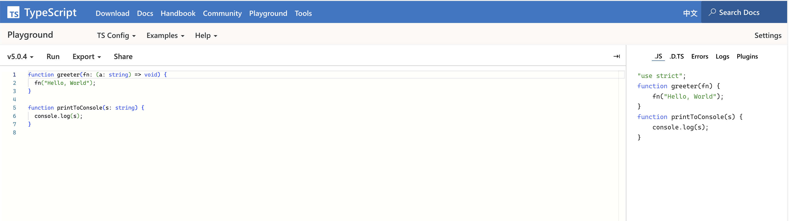

# Typescript 

Hi guys，我是剑大瑞。

## 当学一门新的计算机语言时，我们学的是什么？

这里插一段题外话，提出这个问题的原因是希望我们能从更高抽象上去快速的掌握并理解一门计算机语言。我本人除了 JavaScript 之外，还学习了 Python 、Java。最近由于工作的变动，开始在项目中使用 TypeScript ，但没有像当初学习 Js 一样系统学习过，一直处于模仿写的过程，这段时间正在系统学习。

我一直认为，计算机本质上就是一个指令执行机器。我们通过计算机语言将抽象逻辑描述为具体的执行指令，交个计算机去执行任务即可。就像汉语、英语或者日语一样，都是我们描述这个世界的一个工具。比如，在汉语中我们会通过 你、我、他做人称代词，英语中则对应的是 you、me、he。

如果细想一下不难发现，其实人类语言之间的区别就是通过一套自己体系内的变量，在特定的发音与语法规则下，组织成一个单词或者句子，让我们去表达自己的感情、想法、描述周边的事物。

计算机语言也是一样的，就像我所学过的 JS、Python、Java 及正在学习的 Ts，都会有几种不同的变量类型如：数字、字符串、布尔、对象、函数等。再辅以变量声明、逻辑运算符与循环控制语句，就组成了我们可以将抽象逻辑描述为计算机可以理解的具体指令。然后按照我们的指令执行任务就好了。

当然具体到细节，每种语言之间就有所不同了。比如 JS 是一种动态类型、弱类型的解释型语言，而 TS 是一种静态类型、弱类型的编译型语言。如果具体到各个细节这会或许相同、相似或者完全不同。

所以当我们通过一门新的语言与计算机交流时，为了实现高效准确表达自己的逻辑。我们需要学习的是这门语言的特点、规则、细节、各种声明、控制或循环语句。

## 安装 TypeScript

上面说了 TS 是一种静态类型编译语言，因此我们所写的 ts 文件，必须讲过 tsc 的编译才能在浏览器或者 node.js 中运行。

**方案一：**

安装 TypeScript：

```shell
// npm install -D typescript // 局部安装
npm install -g typescript // 全局安装
```

编译 ts 文件：

```shell
tsc demo.ts
```

运行编译后的文件：

```shell
node demo.js
```

**方案二**

如果感觉上面过程比较繁琐，可以使用 ts-node 来直接运行 ts 文件。

> ts-node是一个 TypeScript 执行引擎和 Node.js 的 [REPL](https://en.wikipedia.org/wiki/Read%E2%80%93eval%E2%80%93print_loop)。
>
> 它将 TypeScript JIT 转换为 JavaScript，使你可以直接在 Node.js 上执行 TypeScrip t而无需预编译。这是通过连接 node 的模块加载 api 来实现的，使其能够与其他 node .js 工具和库无缝使用。

安装 ts-node：

```shell
# Locally in your project.
npm install -D typescript
npm install -D ts-node

# Or globally with TypeScript.
npm install -g typescript
npm install -g ts-node

# Depending on configuration, you may also need these
npm install -D tslib @types/node
```

使用 ts-node：

```shell
# Execute a script as `node` + `tsc`.
ts-node script.ts

# Starts a TypeScript REPL.
ts-node

# Execute code with TypeScript.
ts-node -e 'console.log("Hello, world!")'

# Execute, and print, code with TypeScript.
ts-node -p -e '"Hello, world!"'

# Pipe scripts to execute with TypeScript.
echo 'console.log("Hello, world!")' | ts-node

# Equivalent to ts-node --transpileOnly
ts-node-transpile-only script.ts

# Equivalent to ts-node --cwdMode
ts-node-cwd script.ts

# Equivalent to ts-node --esm
ts-node-esm script.ts
```

**方案三：**

如果还嫌麻烦，IDE 都不想打开，就是想体验下 ts，可以使用 TS 官网提供的 Playground:

Playground: https://www.typescriptlang.org/play



不仅可以体验 ts 的类型提示，还可以直观的看到 ts 编译后的代码。

## Typescript 类型入门

### ts 与 js 共有的类型

ts 是 js 的超集，所以 js 所支持的几种数据类型，在 ts 中都会支持，比如：boolean、number、string、null、undefined、bigint、symbol。

**变量声明抽象公式：**

```ts
[变量声明关键字] [变量名]: [变量类型] = [值]
```

- boolean 类型：

```ts
let isMan: boolean = true
```

- number 类型：

```ts
let age: number = 18
```

- string 类型：

```ts
let name: string = '大瑞'
```

- null 类型：

```ts
let obj: null = null
```

- undefined 类型：

```ts
let height: undefined = undefined
```

你可以自己在 [Playground]( https://www.typescriptlang.org/play) 上试试 bigint & symbol 类型。

- 数组类型。

  对于数组类型，数组类似于一个容器，我们可以在数组中存储其他类型。可以抽象为：

```text
[变量声明关键字] [变量名]: [变量类型][] = [值]
```

或者：

```js
[变量声明关键字] [变量名]: Array<变量类型> = [值]
```

比如字符串数组：

```typescript
const list: string[] = ['a', 'b']
const numbers: Array<number> = [1, 2]
```

- 对象类型

  通常在面向对象编程过程中，会使用类型类型来描述一个变量。

```typescript
const person: {
  name: string;
  age: number;
  gender: string;
} = {
  name: '大瑞',
  age: 18,
  gender: 'man'
}
```

但是通常我们不会这么写，在实际的项目中我们会使用 type(类型别名) 或者 interface(接口)  去定义一个对象的类型约束。比如：

```typescript
type Person = {
  name: string;
  age: number;
  gender: string;
}

const person: Person = {
  name: '大瑞',
  age: 18,
  gender: 'man'
}
// 或者
interface Person {
  name: string;
  age: number;
  gender: string;
}

const person: Person = {
  name: '大瑞',
  age: 18,
  gender: 'man'
}
```

这样可以更好的实现类型复用 & 抽象。关于 type(类型别名) 与 interface(接口) 我们后面再细讲。

通过上面的简单示例，我们可以发现对象类型可以抽象为，先定义一个对象类型的类型别名或者接口去描述该对象的属性和行为，在使用通用的变量类型声明抽象公式即可：

```typescript
type 变量类型 = {
	// 通过 key: type 的形式描述属性或者行为
}
// 使用 变量类型
[变量声明关键字] [变量名]: [变量类型] = [值]
```

- 函数类型

  对于函数类型可能比较复杂些。因为函数的定义包括通过 function 关键定义、使用函数表达式的方式定义、通过箭头函数定义、甚至通过 new Function 构造函数定义。这里我们先看下常用的前三种定义方式。

  1. function 关键字定义:

  ```typescript
  function greet(name: string): string {
    return ("Hello, " + name.toUpperCase() + "!!");
  }
  
  function create(name: string, age: number): {
    name: string;
    age: number;
  } {
    return {
      name: number,
      age: age,
    }
  }
  ```

  可以抽象为：

  ```typescript
  function [函数名] ([参数]: [参数类型]): [返回类型] {
    	// 内部逻辑...
  }
  ```

  2. 使用函数表达式的方式定义

  ```typescript
  const greet: (name: string) => string = function (name: string): string {
    return ("Hello, " + name.toUpperCase() + "!!");
  }
  
  const create: (name: strting, age: number) => {
    name: string;
    age: number;
  } = function (name: string, age: number): {
    name: string;
    age: number;
  } {
    return {
      name: name,
      age: age,
    }
  }
  ```

  3. 使用箭头函数定义：

  ```typescript
  const greet: (name: string) => string = (name: string): string => {
    return ("Hello, " + name.toUpperCase() + "!!");
  }
  
  const create: (name: strting, age: number) => {
    name: string;
    age: number;
  } = (name: string, age: number): {
    name: string;
    age: number;
  } => {
    return {
      name: name,
      age: age,
    }
  }
  ```

  上面的代码逻辑虽然简单，但是我们发现整个代码量看下来也是非常繁琐冗余。后面可以使用 type & interface 来简化整个函数的定义过程。

  5. 可选参数

  ```typescript
  function create(name: string, age?: number): {
    name: string;
    age?: number;
  } {
    if(age) {
      return {
        name: name,
        age: age,
      }
    }
    
    return {
      name: number,
    }
  }
  const person = create({ name: 'darui' })
  const person2 = create({ name: 'darui', age: 12 })
  ```

### TypeScript 独有的类型

- any

  `any` 可以说是在 ts 静态类型检测中，为你提供了一条类型检测的逃生通道，ts 将会把声明为 any 类型的变量的静态检查关闭。在类型系统里 `any` 能够兼容所有的类型（包括它自己）。因此，所有类型都能被赋值给它，它也能被赋值给其他任何类型。并且你可以调用声明为 any 类型的变量任何属性，甚至这个属性可能并不存在于变量上~，以下有一个证明例子：

  ```typescript
  let a: any
  a = 3
  console.log(++a)
  a = 'darui'
  console.log(a.split(''))
  a.foo()
  ```

  有上面示例可以看出，当你将变量声明为 any 类型时，相当于关闭了 ts 对此变量的类型检测。如果在项目中大量使用，相当于让 ts 的类型规范失去了意义，极不安全，基本等于在写屎山代码。

- unknown

  unknown 类型与 any 类型非常相似，当你不知道某个变量或者参数的具体类型时，就可以使用 unknown 将 变量声明为 unknown 类型。但是， **unknown 类型相较于 any 类型更加安全**。因为你不能访问声明为 unknown 类型的值的任何属性。

  ```typescript
  function f1(a: any) {
    a.b(); // OK
  }
  function f2(a: unknown) {
    a.b();
    // error: 'a' is of type 'unknown'.
  }
  ```


- never

  never 类型在 ts 中比较特殊。

  

- 联合类型

  ts 允许你基于现有的基础类型或者自定义类型，创建一个联合类型。通过 `|` 符将多个连接起来。比如

  ```typescript
  function printId(id: number | string) {
    if (typeof id === "string") {
      // In this branch, id is of type 'string'
      console.log(id.toUpperCase());
    } else {
      // Here, id is of type 'number'
      console.log(id);
    }
  }
  // OK
  printId(101);
  // OK
  printId("202");
  // Error
  printId({ myID: 22342 });
  ```

  上面的 id 可以是数字类型或者字符串类型，但是如果需要访问值得具体属性，需要先进行[类型收缩](https://www.typescriptlang.org/docs/handbook/2/narrowing.html)，否则会报错。

- 类型别名

  类型别名的最大作用就是实现类型的复用，让你在项目中可以整合基础类型、联合类型、对象类型。例如：

  ```typescript
  type Point = {
    x: number;
    y: number;
  };
   
  // Exactly the same as the earlier example
  function printCoord(pt: Point) {
    console.log("The coordinate's x value is " + pt.x);
    console.log("The coordinate's y value is " + pt.y);
  }
   
  printCoord({ x: 100, y: 100 });
  // 命名联合类型
  type ID = number | string;
  function printId(id: ID) {
    if (typeof id === "string") {
      // In this branch, id is of type 'string'
      console.log(id.toUpperCase());
    } else {
      // Here, id is of type 'number'
      console.log(id);
    }
  }
  ```

  通过上面的示例不难看出，类型别名就是通过 type 关键字，对原有的类型进行重新命名。

- 接口
- 枚举
- 抽象类


- REPL: https://en.wikipedia.org/wiki/Read%E2%80%93eval%E2%80%93print_loop
- ts-node:  https://github.com/TypeStrong/ts-node
- never：https://www.zhihu.com/question/354601204
- 类型收缩：https://www.typescriptlang.org/docs/handbook/2/narrowing.html


