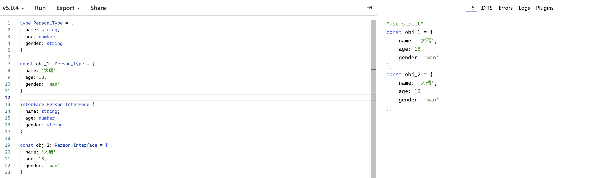

# Typescript 

> 当学一门新的计算机语言时，我们学的是什么？
>
> 这里插一段题外话，提出这个问题的原因是希望我们能从更高抽象上去快速的掌握并理解一门计算机语言。
>
> 我一直认为，计算机本质上就是一个指令执行机器。我们通过计算机语言将抽象逻辑描述为具体的执行指令，交个计算机去执行任务即可。就像汉语、英语或者日语一样，都是我们描述这个世界的一个工具。比如，在汉语中我们会通过 你、我、他做人称代词，英语中则对应的是 you、me、he。
>
> 如果细想一下不难发现，其实人类语言之间的区别就是通过一套自己体系内的变量，在特定的发音与语法规则下，组织成一个单词或者句子，让我们去表达自己的感情、想法、描述周边的事物。
>
> 计算机语言也是一样的，就像 JS、Python、Java 、 Ts，都会有几种不同的变量类型如：数字、字符串、布尔、对象、函数等。再辅以变量声明、逻辑运算符与循环、控制语句，就组成了我们可以将抽象逻辑描述为计算机可以理解的具体指令。然后按照我们的指令执行任务就好了。
>
> 当然具体到细节、特征，每种语言之间就有所不同了。比如 JS 是一种动态类型、弱类型的解释型语言，而 TS 是一种静态类型、弱类型的编译型语言。如果具体到各个细节，它们或许相同、相似或者完全不同。
>
> 所以当我们通过一门新的语言与计算机交流时，为了实现高效准确表达自己的逻辑。我们需要学习的是这门语言的设计思想、规则、细节、各种声明、控制或循环语句。

## 安装 TypeScript

上面说了 TS 是一种静态类型编译语言，因此我们所写的 ts 文件，必须讲过 tsc 的编译才能在浏览器或者 node.js 中运行。

### **方案一：**

安装 TypeScript：

```shell
// npm install -D typescript // 局部安装
npm install -g typescript // 全局安装
```

编译 ts 文件：

```shell
tsc demo.ts
```

运行编译后的文件：

```shell
node demo.js
```

### **方案二**

如果感觉上面过程比较繁琐，可以使用 ts-node 来直接运行 ts 文件。

> ts-node是一个 TypeScript 执行引擎和 Node.js 的 [REPL](https://en.wikipedia.org/wiki/Read%E2%80%93eval%E2%80%93print_loop)。
>
> 它将 TypeScript JIT 转换为 JavaScript，使你可以直接在 Node.js 上执行 TypeScrip t而无需预编译。这是通过连接 node 的模块加载 api 来实现的，使其能够与其他 node .js 工具和库无缝使用。

安装 ts-node：

```shell
# Locally in your project.
npm install -D typescript
npm install -D ts-node

# Or globally with TypeScript.
npm install -g typescript
npm install -g ts-node

# Depending on configuration, you may also need these
npm install -D tslib @types/node
```

使用 ts-node：

```shell
# Execute a script as `node` + `tsc`.
ts-node script.ts

# Starts a TypeScript REPL.
ts-node

# Execute code with TypeScript.
ts-node -e 'console.log("Hello, world!")'

# Execute, and print, code with TypeScript.
ts-node -p -e '"Hello, world!"'

# Pipe scripts to execute with TypeScript.
echo 'console.log("Hello, world!")' | ts-node

# Equivalent to ts-node --transpileOnly
ts-node-transpile-only script.ts

# Equivalent to ts-node --cwdMode
ts-node-cwd script.ts

# Equivalent to ts-node --esm
ts-node-esm script.ts
```

### **方案三：**

如果还嫌麻烦，IDE 都不想打开，就是想体验下 ts，可以使用 TS 官网提供的 Playground:

Playground: https://www.typescriptlang.org/play


不仅可以体验 ts 的类型提示，还可以直观的看到 ts 编译后的代码。

## Typescript 类型入门

### ts 与 js 共有的类型

ts 是 js 的超集，所以 js 所支持的几种数据类型，在 ts 中都会支持，比如：boolean、number、string、null、undefined、bigint、symbol。

#### **变量声明抽象公式：**

```ts
[变量声明关键字] [变量名]: [变量类型] = [值]
```

#### boolean 类型：

```ts
let isMan: boolean = true
```

#### number 类型：

```ts
let age: number = 18
```

#### string 类型：

```ts
let name: string = '大瑞'
```

#### null 类型：

```ts
let obj: null = null
```

#### undefined 类型：

```ts
let height: undefined = undefined
```

原始类型被编译后：


你可以自己在 [Playground]( https://www.typescriptlang.org/play) 上试试 bigint & symbol 类型。

#### 数组类型

对于数组类型，数组类似于一个容器，我们可以在数组中存储其他类型。可以抽象为：

```text
[变量声明关键字] [变量名]: [变量类型][] = [值]
```

或者：

```js
[变量声明关键字] [变量名]: Array<变量类型> = [值]
```

比如字符串数组：

```typescript
const list: string[] = ['a', 'b']
const numbers: Array<number> = [1, 2]
```

#### 对象类型

通常在面向对象编程过程中，会使用类型类型来描述一个变量。

```typescript
const person: {
  name: string;
  age: number;
  gender: string;
} = {
  name: '大瑞',
  age: 18,
  gender: 'man'
}
```

对象类型可选参数：

```typescript
let person: {
  name: string;
  age: number;
  gender?: string;
}

person  = {
  name: '大瑞',
  age: 18,
}

function printName(obj: {
  name: string;
  age: number;
  gender?: string;
}) {
  // ...
}
// No
printName({ name: "darui" });
// Ok
printName({ name: "darui", age: 18 });
```

引用类型编译结果：


但是通常我们不会这么写，在实际的项目中我们会使用 type(类型别名) 或者 interface(接口)  去定义一个对象的类型约束。比如：

```typescript
type Person = {
  name: string;
  age: number;
  gender: string;
}

const person: Person = {
  name: '大瑞',
  age: 18,
  gender: 'man'
}
// 或者
interface Person {
  name: string;
  age: number;
  gender: string;
}

const person: Person = {
  name: '大瑞',
  age: 18,
  gender: 'man'
}
```

这样可以更好的实现类型复用 & 抽象。关于 type(类型别名) 与 interface(接口) 我们后面再细讲。

通过上面的简单示例，我们可以发现对象类型可以抽象为，先定义一个对象类型的类型别名或者接口去描述该对象的属性和行为，在使用通用的变量类型声明抽象公式即可：

```typescript
type 变量类型 = {
	// 通过 key: type 的形式描述属性或者行为
}
// 使用 变量类型
[变量声明关键字] [变量名]: [变量类型] = [值]
```

类型别名和接口的编译结果：



#### 函数类型

对于函数类型可能比较复杂些。因为函数的定义包括通过 function 关键定义、使用函数表达式的方式定义、通过箭头函数定义、甚至通过 new Function 构造函数定义。这里我们先看下常用的前三种定义方式。

1. function 关键字定义:

```typescript
function greet(name: string): string {
  return ("Hello, " + name.toUpperCase() + "!!");
}

function create(name: string, age: number): {
  name: string;
  age: number;
} {
  return {
    name: name,
    age: age,
  }
}
```

可以抽象为：

```typescript
function [函数名] ([参数]: [参数类型]): [返回类型] {
  	// 内部逻辑...
}
```

2. 使用函数表达式的方式定义

```typescript
const greet: (name: string) => string = function (name: string): string {
  return ("Hello, " + name.toUpperCase() + "!!");
}

const create: (name: strting, age: number) => {
  name: string;
  age: number;
} = function (name: string, age: number): {
  name: string;
  age: number;
} {
  return {
    name: name,
    age: age,
  }
}
```

可以抽象为：

```
const [函数名]: [函数类型] = function (param) [函数体]
```


3. 使用箭头函数定义：

```typescript
const greet: (name: string) => string = (name: string): string => {
  return ("Hello, " + name.toUpperCase() + "!!");
}

const create: (name: strting, age: number) => {
  name: string;
  age: number;
} = (name: string, age: number): {
  name: string;
  age: number;
} => {
  return {
    name: name,
    age: age,
  }
}
```

上面的代码逻辑虽然简单，但是我们发现整个代码量看下来也是非常繁琐冗余。后面可以使用 type & interface 来简化整个函数的定义过程。

5. 可选参数

```typescript
function create(name: string, age?: number): {
  name: string;
  age?: number;
} {
  if(age) {
    return {
      name: name,
      age: age,
    }
  }
  
  return {
    name: name,
  }
}
const person = create('darui')
const person2 = create('darui', 12)
```

### 简单练习

- 使用 ts 写个二分法：

```typescript
function search(nums: number[], target: number): number {
    let left: number = 0;
    let right: number = nums.length - 1;
    while (left <= right) {
        let mid: number = left + ((right - left) >> 1);
        if (nums[mid] == target) return mid;
        else if (nums[mid] > target) {
            right = mid - 1;
        } else {
            left = mid + 1;
        }
    }
    return -1;
}
// 箭头函数方式
const search: (nums: number[], target: number) => number = function (nums: number[], target: number): number {
    let left: number = 0;
    let right: number = nums.length - 1;
    while (left <= right) {
        let mid: number = left + ((right - left) >> 1);
        if (nums[mid] == target) return mid;
        else if (nums[mid] > target) {
            right = mid - 1;
        } else {
            left = mid + 1;
        }
    }
    return -1;
}
// 还可以这样，声明一个函数类型别名
type BinarySearch = (nums: number[], target: number) => number

const search: BinarySearch = function (nums: number[], target: number): number {
    let left: number = 0;
    let right: number = nums.length - 1;
    while (left <= right) {
        let mid: number = left + ((right - left) >> 1);
        if (nums[mid] == target) return mid;
        else if (nums[mid] > target) {
            right = mid - 1;
        } else {
            left = mid + 1;
        }
    }
    return -1;
}
```

### TypeScript 独有的类型

#### any

`any` 可以说是在 ts 静态类型检测中，为你提供了一条类型检测的逃生通道，ts 将会把声明为 any 类型的变量的静态检查关闭。在类型系统里 `any` 能够兼容所有的类型（包括它自己）。因此，所有类型都能被赋值给它，它也能被赋值给其他任何类型。并且你可以调用声明为 any 类型的变量任何属性，甚至这个属性可能并不存在于变量上~，以下有一个证明例子：

```typescript
let a: any
a = 3
console.log(++a)
a = 'darui'
console.log(a.split(''))
a.foo()
```

有上面示例可以看出，当你将变量声明为 any 类型时，相当于关闭了 ts 对此变量的类型检测。如果在项目中大量使用，相当于让 ts 的类型规范失去了意义，极不安全，基本等于在写屎山代码。

#### unknown

unknown 类型与 any 类型非常相似，当你不知道某个变量或者参数的具体类型时，就可以使用 unknown 将 变量声明为 unknown 类型。但是， **unknown 类型相较于 any 类型更加安全**。因为你不能访问声明为 unknown 类型的值的任何属性。

```typescript
function f1(a: any) {
  a.b(); // OK
}
function f2(a: unknown) {
  a.b();
  // error: 'a' is of type 'unknown'.
}
```

#### never 

在 never 类型属于 ts 中的 bottom type。主要是为了做出**绝对安全的类型判断**，经常需要出现在判断语句中。比如 if else、 switch、三元运算符、错误判断、try catch 中。

比如：

```ts
type ListLength<T> = T extends Array ? T : never
```

条件判断

```typescript
function fn(x: string | number) {
  if (typeof x === "string") {
    // do something
  } else if (typeof x === "number") {
    // do something else
  } else {
    x; // has type 'never'!
  }
}
```

上面的函数 x 是 string | number 的联合类型，当需要通过条件语句进行类型收窄的时候。else 最终返回的就是 never 类型，相较于仅判断 x 是 string 类型，要更加安全。

在 switch 语句中穷尽检查：

```typescript
type Shape = Circle | Square;
 
function getArea(shape: Shape) {
  switch (shape.kind) {
    case "circle":
      return Math.PI * shape.radius ** 2;
    case "square":
      return shape.sideLength ** 2;
    default:
      const _exhaustiveCheck: never = shape;
      return _exhaustiveCheck;
  }
}
```


- 在类型运算中 never 类型是所有类型的子类型，never 类型可以赋值给任意类型，而其他类型则不能赋值给 never 类型（除了 never 本身）。比如

```typescript
type CheckType<T> = never extends T ? true : false
```

 CheckType<T> 永远为 true。

- 两个不相交的类型的交叉类型是 never 类型

``` typescript
type Cross = 1 & 'a'
```

#### 类型别名

类型别名的最大作用就是实现类型的复用，让你在项目中可以整合基础类型、联合类型、对象类型。例如：

```typescript
type Point = {
  x: number;
  y: number;
};
 
// Exactly the same as the earlier example
function printCoord(pt: Point) {
  console.log("The coordinate's x value is " + pt.x);
  console.log("The coordinate's y value is " + pt.y);
}
 
printCoord({ x: 100, y: 100 });
// 命名联合类型
type ID = number | string;
function printId(id: ID) {
  if (typeof id === "string") {
    // In this branch, id is of type 'string'
    console.log(id.toUpperCase());
  } else {
    // Here, id is of type 'number'
    console.log(id);
  }
}
```

通过上面的示例不难看出，类型别名就是通过 type 关键字，对原有的类型进行重新命名。

**声明一个函数类型别名:**

```typescript
type DescribableFunction = {
  description: string;
  (someArg: number): boolean;
};
function doSomething(fn: DescribableFunction) {
  console.log(fn.description + " returned " + fn(6));
}
 
function myFunc(someArg: number) {
  return someArg > 3;
}
myFunc.description = "default description";
 
doSomething(myFunc);
```

**声明一个构造函数类型别名：**

```typescript
type SomeConstructor = {
  new (s: string): SomeObject;
};

function fn(ctor: SomeConstructor) {
  return new ctor("hello");
}
```

#### 接口 interface 

接口通常是用于描述对象类型。例如：

```typescript
interface Person {
  name: string;
  age: number;
  email: string;
}

function fn(person: Person) {
	console.log(`name: ${person.name}`)
  console.log(`name: ${person.age}`)
  console.log(`name: ${person.email}`)
}
fn({
  name: 'darui',
  age: 18,
  email: 'xxxx@gmail.com'
})
```

当你调用 fn 传参时，ts 会校验参数结构，如果参数结构不符合接口定义，则会标红提示。

结合上面我们说的类型别名 type，可以发现 type 与 interface 的功能非常相似，其实多数情况下，两者都可以实现互换。

两者的**关键区别在于 interface 可以实现继承和重载**。例如

```ts
interface Animal {
  name: string
}
// Bear 继承了 Animal 的结构
interface Bear extends Animal {
  honey: boolean
}

function getBear(): Bear {
  return {
    name: 'bear',
    honey: true
  }
}

const bear = getBear() 
bear.name
bear.honey

// 使用类型别名
type Animal = {
  name: string
}
// 只能通过 & 符 通过交叉类型创建一个新的类型
type Bear = Animal & { 
  honey: boolean 
}

const bear = getBear();
bear.name;
bear.honey;
        
```

**重复声明：**

```typescript
interface Person {
  name: string
}
// 可以再次声明 Person 接口，向 Person 接口添加属性
interface Person {
  age: 18
}

const person: Person = {
  name: 'amos',
  age: 18
}

// 如果使用 type 则会提示：Duplicate identifier 'Person'
type Person = {
  name: string
}
type Person = {
  age: 18
}

const person: Person = {
  name: 'amos',
  age: 18
}
```

经过两次声明，Person 最终有了 name、age 两个属性。而 type 不允许出现类型名称重复的情况。

**声明函数类型接口：**

```typescript
interface DescribableFunction {
  description: string;
  (someArg: number): boolean;
};
function doSomething(fn: DescribableFunction) {
  console.log(fn.description + " returned " + fn(6));
}
 
function myFunc(someArg: number) {
  return someArg > 3;
}
myFunc.description = "default description";
 
doSomething(myFunc);
```

#### 联合类型

ts 允许你基于现有的基础类型或者自定义类型，创建一个联合类型，通过 `|` 符将多个连接起来。声明为联合类型的值，其值类型可以是联合类型中的任何一种情况。比如

```typescript
function printId(id: number | string) {
  if (typeof id === "string") {
    // In this branch, id is of type 'string'
    console.log(id.toUpperCase());
  } else {
    // Here, id is of type 'number'
    console.log(id);
  }
}
// OK
printId(101);
// OK
printId("202");
// Error
printId({ myID: 22342 });
```

上面的 id 可以是数字类型或者字符串类型，但是如果需要访问值得具体属性，需要先进行[类型收缩](https://www.typescriptlang.org/docs/handbook/2/narrowing.html)，否则会报错。

#### 交叉类型

ts 允许你基于现有的基础类型或者自定义类型，创建一个交叉类型，通过 `&` 符将多个连接起来。声明为交叉类型的值，其值属性类型**必须**与交叉类型相同。

```typescript
type CrossType = {
  name: string
} & {
	age: number
}
function printObj(obj: CrossType) {
  console.log(obj)
}
// Error
printObj({
  name: 'darui'
});
// OK
printObj({
  name: 'darui'
  age: 18
});
```

#### 简单练习

- N 叉树的前序遍历

```typescript
type Node = {
  val: number,
  children: Node[]
}

function preOrder(root: Node): number[] {
  if(root === null) return []
  const result: number = []
  const stack: Node[] = [root]
  while(stack.length) {
      let node = stack.pop()
      result.push(node.val)
      for(let i: number = node.children.length - 1; i >= 0; i--) {
          stack.push(node.children[i])
      }
  }
  return result
}
```

#### 枚举

枚举类型经常用于常量管理。它的特点在于在使用枚举的时候，你已经知道值可以出现的所有类型。比如：

```typescript
enum Status {
  Success = 0,
  Failed = 1,
  None = -1
}

const a: Status = Status.Success
```

可以基于上面示例，可以想象下，如果项目中大量需要基于 1 或者 0 来判断某个数据的状况，相较于项目中大量的去直接写 1 或者 0 ，使用枚举来做状态的管理的映射要更直观，更方便项目的维护。

枚举类型编译结果：


另外枚举可以有多种类型：

- 字符串枚举

  ```typescript
  enum Direction {
    Up = "UP",
    Down = "DOWN",
    Left = "LEFT",
    Right = "RIGHT",
  }
  ```

  

- 数字枚举

  ```typescript
  enum Direction {
    Up,
    Down,
    Left,
    Right,
  }
  ```

  - 如果不给枚举值赋值的话，它们默认从 0 开始递增，Up = 0，Down = 1，Left = 2，Right = 3

  

  - 如果给枚举类型赋值，比如令 Up = 1，则 Down 、Left、Right 默认会在 Up 的基础上递增。

  

观察上图可以发现，当枚举中的赋值不符合递增的时候，编译后的 ts 会出现不同的 key 对应相同 value 的情况。

#### 元组

在 ts 中 元组和数组非常相似，但是通常数组是一系列相同类型值的集合，而元组中可以存在不同类型的值，类似于混合数组。元组可以像数组一样被解构。

```typescript
let tuple: [number, string, boolean] = [7, "hello", true];
let [a, b, c] = tuple; // a: number, b: string, c: boolean

```

#### 泛型

泛型是实现类型复用和实现灵活编程的重要基础。已函数为例：

```typescript
function add(a: number, b: number): number {
  return a + b
}
add(1, 2)
```

add 函数可以实现两数相加，但是我们知道在 ts 中，我们也可以通过 `+` 操作进行字符串拼接。如果我们需要实现一个字符串拼接的函数，如果没有泛型的话，我们需要再写一个函数：

```typescript
function addStr(a: string, b: string): string {
  return a + b
}
add('da', 'rui')
```

这样会使代码变得冗余。

如果使用泛型的解决方式：

```typescript
function add<T>(a: T, b: T): T {
  return a + b
}

// Ok
let res = add<number>(1, 2) // number
let str = add<string>('da', 'rui') // string
```

- 通过上面的代码示例可以知道，泛型其实就是在定义函数的参数和返回值类型时，先通过一个类型变量，进行参数和返回值的类型占位，在具体调用函数的时候在确定具体类型。
- ts 会在调用的时候捕获传入的泛型和参数类型，进行类型检测。
- 在 add 函数中，我们通过 T 在作为泛型，add\<T\> 用于类型占位。当调用的时候在根据需求确定具体类型。
- 这种方式完美解决了两个函数逻辑重复的问题。

##### 在类型别名中使用泛型

```typescript
type obj<T> = {
  a: T,
  b: number
}
// Ok
const obj: Obj<string> = {
  a: 'a',
  b: 12
}
```

##### 在接口中使用泛型

```typescript
interface obj<T> {
  a: T,
  b: number
}
// Ok
const obj: Obj<string> = {
  a: 'a',
  b: 12
}
```

##### 使用泛型&接口定义函数

```typescript
interface Add<Type> {
  <Type>(a: Type, b: Type): Type
}

function add<T>(a: T, b: T): T {
  return a + b
}

const myAdd: Add = add

myAdd<number>(1, 2)
myAdd<string>('da', 'rio')

```

##### 泛型约束

在使用泛型函数时，可能会访问你认为参数上已经存在的属性。但是由于是 泛型函数，ts 在静态检测时并不能基于泛型变量确定值上是否有要访问的属性，这种情况下就会抛出警告。

为了避免此类情况的发生，可以使用 extends 关键词对泛型进行约束。

以官网的代码为示例：

```typescript
function loggingIdentity<Type>(arg: Type): Type {
  console.log(arg.length); // error: Property 'length' does not exist on type 'Type'.
  return arg;
}
```

定义一个约束类型：

```typescript
interface LengthProperty {
  length: number
}

function loggingIdentity<Type extends LengthProperty>(arg: Type): Type {
  console.log(arg.length); // error: Property 'length' does not exist on type 'Type'.
  return arg;
}

// OK
let a: string[] = ['a', 'b', 'c']
loggingIdentity<string[]>(a)

// OK 
loggingIdentity<string>('abcd')

type Distance = {
  length: number
  x: number
  y: number
}
let b: Distance = {
  length: 100,
  x: 0,
  y: 100
}
// OK
loggingIdentity<Distance>(b)
```

通过上面代码示例，泛型约束其实就是通过 interface ，定义一个约束类型，这个 接口 上需要定义好被约束的泛型必须存在的属性。再通过 extends 关键字对泛型进行约束即可。

> 注意这里不可以使用 type 类型别名来定义约束类型，因为 type 类型不可以被 extends 。

#### 简单练习

目前到这里我们已经对 ts 中的常用类型的特点已经有了基本的了解。这里我们对上面的 N 叉树的前置遍历函数，让其可以支持 N 叉树 或 二叉树：

```typescript
interface NodeConstraints {
	val: number
  children?: NodeConstraints[]
  left?: NodeConstraints
  right?: NodeConstraints
}

type Node_1 = {
  val: number,
  children?: Node_1[]
}

const tree_1: Node_1 = {
  val: 1,
  children: [
    {
      val: 2,
      children: [{ val: 3, children: [{ val: 4 }]}]
    },
    {
      val: 5,
      children: [{ val: 6, children: [{ val: 7 }]}]
    },
    {
      val: 8,
      children: [{ val: 9, children: [{ val: 10 }]}]
    }
  ]
}


type Node_2 = {
  val: number,
  left?: Node_2,
  right?: Node_2
}

const tree_2: Node_2 = {
  val: 1,
  left: {
    val: 2,
    left: {
      val: 4,
      right: {
        val: 5,
      },
    },
    right: {
      val: 6,
    },
  },
  right: {
    val: 3,
    left: {
      val: 8,
    },
    right: {
      val: 7,
    },
  }
}

function preOrder<T extends NodeConstraints>(root: T): number[] {
  if(root === null) return []
  
  const result: number[] = []
  const stack: NodeConstraints[] = [root]
  
  while(stack.length) {
    
      let node = stack.pop()
      node && result.push(node.val)
    
      if(node && 'children' in node) {
        for (let i: number = node?.children!.length - 1; i >= 0; i--) {
            node?.children && stack.push(node.children[i])
        }
      } else {
        node?.right && stack.push(node.right)
        node?.left && stack.push(node.left)
      }
  }
  
  return result
}
// Ok
console.log(preOrder<Node_1>(tree_1));
console.log(preOrder<Node_2>(tree_2))
```

#### 函数类型进阶

通过上面的学习，我们已经对 ts 中的各种类型和函数的基本形态有了了解，现在可以借此更深入的学习下。

##### 构造函数类型声明

我们知道在 js 中 函数是可以通过 new 方法调用，去创建一个对象，实现面向对象编程的。在 ts 中，你可以在函数调用签名前面通过加 `new` 关键字的形式，实现一个构造函数的声明：

```typescript
type SomeConstructor = {
  new (s: string): SomeObject;
};

function fn(ctor: SomeConstructor) {
  return new ctor("hello");
}
```

##### 使用类型别名定义函数类型

```typescript
type MyFn = {
  (a: number, b: number): number
}
const fn: MyFn = (a: number, b: number) => a + b

// 可选参数
type MyFn = {
  (a: number, b?: number): number
}
const fn: MyFn = (a: number, b?: number) => // do something 
```

##### 使用接口定义函数类型

```typescript
interface MyFn {
  (a: number, b: number): number
}
const fn: MyFn = (a: number, b: number) => a + b
```

##### 泛型函数

```typescript
function fn<T>(params: T): T {
  // do something 
}
```

##### 函数重载

函数重载主要在解决 **当相同逻辑的函数需要重构为一个函数时，需要面对不同参数或者返回类型的冲突问题**。为此你可以在一个被多次重载的函数上，做出不同逻辑的处理。例如：

```typescript
function makeDate(timestamp: number): Date;
function makeDate(m: number, d: number, y: number): Date;
function makeDate(mOrTimestamp: number, d?: number, y?: number): Date {
  if (d !== undefined && y !== undefined) {
    return new Date(y, mOrTimestamp, d);
  } else {
    return new Date(mOrTimestamp);
  }
}
const d1 = makeDate(12345678);
const d2 = makeDate(5, 5, 5);
const d3 = makeDate(1, 3); // No
```

在上面函数中我们进行了两次重载，第一次是接受一个参数，第二次是接受三个参数。

这里需要注意的是我们在第三次声明函数时，已经选择了可选传参的方式：

 `function makeDate(mOrTimestamp: number, d?: number, y?: number): Date`

但是在执行 `const d3 = makeDate(1, 3)` 的时候，发生了报错。

这是因为 **函数重载签名** 并不同于 **函数实现签名**。而最后一次声明是函数实现签名。在 ts 中函数实现签名并不能被外部看到。例如

```ts
function fn(x: boolean): void;
// Argument type isn't right
function fn(x: string): void;
//Error: This overload signature is not compatible with its implementation signature.
function fn(x: boolean) {}
```

上面的代码会提示错误，正确的写法应该是在实现签名上做下联合声明处理：

```typescript
// 函数重载签名
function fn(x: boolean): void;
function fn(x: string): void;
// 函数实现签名
function fn(x: boolean | string): void {
  // ...
}
```

所以当使用函数重载的时候，最少应该在**函数实现签名**上有两个或两个以上的**函数重载签名**。

当然从上面的示例可以看出使用联合类型做到和函数重载一样的问题，例如：

```typescript
// 重载
function reverse(x: number): number;
function reverse(x: string): string;
function reverse(x: number | string): number | string | void {
    if (typeof x === 'number') {
        return Number(x.toString().split('').reverse().join(''));
    } else if (typeof x === 'string') {
        return x.split('').reverse().join('');
    }
}
// 使用联合类型
function reverse(x: number | string): number | string | void {
    if (typeof x === 'number') {
        return Number(x.toString().split('').reverse().join(''));
    } else if (typeof x === 'string') {
        return x.split('').reverse().join('');
    }
}
```

但是上面使用联合类型的时候会导致返回值的类型出现不确定性。而函数重载可以很好的解决这个问题。

### Typescript 特点

#### 类型推断

如果在声明值的时候没有指定类型，那么 ts 会根据值得类型推断一个类型。所以说在 ts 中你通常可以写 js 代码。

```typescript
let a = 12

a = 19 // Ok

a = 'darui' // Error
```

变量 a 在声明时被断言为了 number 类型，所以在进行 `a = 'darui'` 操作时会报错，一个 string 类型的值不能赋值给 number 类型。

#### 类型断言

当你想访问值的某一个具体的属性时，ts 可能并不知道这个值上是否存在这个属性，会抛出一个错误，这个时候你可以使用 `as` 关键字对值手动指定类型，例如：

```typescript
type Value = string | number;

const a: Value = 'darui';

(a as string).split('')
```

- 在 ts 中类型断言经常被用于将一个值断言为更具体或者更模糊的值。
  - 将一个联合类型断言为更具体的值
  - 将一个父类断言为一个更具体子类
  - 将任何一个类型断言为 any
  - 将 any 断言为更具体的类型
- 注意类型断言虽然可以让你手动去更改一个值的类型，但是这种行为非常危险，虽然类型断言可以让你避免编译时的错误，但是在编译结果中会去除类型断言。它的安全性要小于类型收窄。

#### 类型收窄

类型收窄又称类型守卫，可以让你在条件判断时收缩值的类型范围。

- typeof 类型收窄。在 ts 中可以通过 typeof 将值收窄为预期的类型。

```typescript
function padLeft(padding: number | string, input: string) {
  return " ".repeat(padding) + input;
}
```

上面代码会抛出错误，因为 repeat 方法仅接受 number 类型的值。更正为：

```typescript
function padLeft(padding: number | string, input: string) {
  if (typeof padding === "number") {
    return " ".repeat(padding) + input;
  }
  return padding + input;
}
```


在意这个例子为例，这里如果你使用了 类型断言 也可以解决报错：

```typescript
function padLeft(padding: number | string, input: string) {
  return " ".repeat(padding as number) + input;
}
```


对比两个编译结果，可以看出类型收窄要比类型断言安全很多。

- 真值收窄。要知道在 js 中有是存在类型转换的，在布尔转换中， 0、''、null、undefined、NaN、0n 在进行判断操作或者 || 、&& 操作时都会转为 false。

```typescript
type Person = {
  name: string
  age?: number
}
const Ross = {
  name: 'Ross'
}

function printName (person: Person) {
  if(person.age) {
    console.log(person.age)
  }
}
```

- 上面 person.age 在条件判断中会转为 布尔值。

对于其他布尔转换也是同样的道理。

- 全等收窄，在两个值的类型判断的过程中，如果两个值类型匹配，则会收窄为同一类型。在 ts 中使用 switch 语句和 ===、!==、==、!= 可以做类型收窄。

```typescript
function print (a: string | number[], b: number[] | string[]) {
  if(a === b) {
    console.log(a)
  } else {
    // ...
  }
}
```

当 if 条件为 true 的时候， a、b 被收窄为 `number[]`。

- `in` 操作收窄。在 js 中，我们可能经常会使用 in 操作符判断一个对象上是否存在某个属性。在 ts 中，则可以通过 in 操作符判断一个类型上是否存在某个属性来实现类型收窄。

```typescript
type Fish = { swim: () => void };
type Bird = { fly: () => void };
 
function move(animal: Fish | Bird) {
  if ("swim" in animal) {
    return animal.swim();
  }
 
  return animal.fly();
}

```

当 if 判断为 true 的时候，animal 被收窄为 Fish 类型。

- Instanceof 操作收窄。在 js 中可以通过 instanceof 操作符判断一个值是否是一个类的实例。则 ts 中可以通过 instanceof 收窄值得类型范围。

```typescript
function logValue(x: Date | string) {
  // x 被收窄为 Date 类型
  if (x instanceof Date) {
    console.log(x.toUTCString());
               
(parameter) x: Date
  } else {
    console.log(x.toUpperCase());
               
(parameter) x: string
  }
}
```


参考：

- REPL: https://en.wikipedia.org/wiki/Read%E2%80%93eval%E2%80%93print_loop
- ts-node:  https://github.com/TypeStrong/ts-node
- 类型收缩：https://www.typescriptlang.org/docs/handbook/2/narrowing.html


