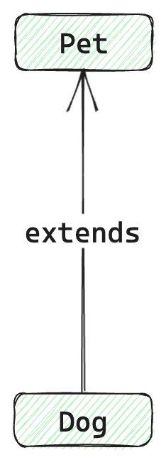

最近在搬砖的时候，遇到一个场景，需要根据已存在的联合类型，将其转为交叉类型：

```typescript
type Preson = {  
  name: string
} | {
  age: number
} | {
  needMoney: boolean
}

type Result = Uinon2Intersection<Preson>
```

期望通过 `Uinon2Intersection` 转换后，得到的 `Result`：

```typescript
type Result = {  
  name: string
} & {
  age: number
} & {
  needMoney: boolean
}
```

刚开始感觉很简单。我想已经会了[类型体操基本动作四件套](https://zhuanlan.zhihu.com/p/640499290)了。通过遍历联合类型，然后遍历的时候通过 `key` 读取属性值就行了，我啪啪啪就写出来了，就像这样：

```typescript
type U2I<T> = {
  [key in keyof T]: T[key]
}

type Result = U2I<Preson>
```

实际得到的是:

```typescript
type Result = U2I<{
    name: string;
}> | U2I<{
    age: number;
}> | U2I<{
    needMoney: boolean;
}>
```

Nmmm，这完全不是我期望的样子啊，然后又想了想基础四件套，感觉遇到坑了，好像仅靠四件套并不能解决啊。

先说下，上面这种情况是因为**[对于联合类型，在遍历操作或者进行条件类型判断的时候，会发生类型分配](https://www.typescriptlang.org/docs/handbook/2/conditional-types.html#distributive-conditional-types)**。就像下面：

```typescript
type ToArray<Type> = Type extends any ? Type[] : never;

type StrArrOrNumArr = ToArray<string | number>;
```

其实得到：

```typescript
type StrArrOrNumArr = string[] | number[]
```

如果想得到:  `(string | number)[]`。你需要这么写：

```typescript
type ToArrayNonDist<Type> = [Type] extends [any] ? Type[] : never;
```

回到正文，如果说我们想通过一个工具类型实现联合类型到交叉类型的转换，那需要了解一下下面几个 `ts` 关键概念：**协变、逆变、双向协变、不变性。**

## 类型兼容与可替代性

我们先说说类型兼容与可替代性，因为这两个概念与协变、逆变密切相关。

`Typescript` 的类型兼容特性是基于类型结构的，其基本规则是：**如果 y 类型至少有一些与 x 类型相同的成员，则 x 类型与 y 类型兼容**。

例如，设想一个名为 `Pet` 的接口的代码，该接口有一个 `name` 属性；一个名为 `Dog` 的接口，该接口有 `name`、`breed` 属性。像下面这样：

```typescript
interface Pet {
  name: string;
}
interface Dog {
  name: string;
  breed: string
}

let pet: Pet;
// dog's inferred type is { name: string; owner: string; }
let dog: Dog = { name: "大哥", breed: "罗威纳" };
pet = dog;
```

`dog` 对象中存在 `Pet` 接口中最基本的属性成员 `name`。则 `dog` 可以赋值给 `pet` 变量。

这是因为 `Dog` 属性中存在与 `Pet` 相同的属性。

我们写一个 `IsSubTyping` 工具类型，用于判断类型之间的继承关系：

```typescript
type IsSubTyping<T, U> = T extends U ? true : false

type R0 = IsSubTyping<Dog, Pet> // true
```

通过上面代码，我们得到的 `R = true`。这说明，虽然我们没有显示的声明 `Dog  extends Pet`，但是 `ts` 内部判断这两个接口是兼容且继承的。

其实更符合规范的就是显示声明**继承**。

```typescript
interface Pet {
  name: string;
}

interface Dog extends Pet {
  breed: string;
}

let pet: Pet = { name: "宠物" };
let dog: Dog = { name: "大哥", breed: "罗威纳" };

pet = dog; // Ok
dog = pet; // Error
// Property 'breed' is missing in type 'Animal' but required in type 'Dog'.
```

当 `dog` 赋值给 `animal` 是可以的，但是反过来不行。这是因为 `Dog` 是 `Pet` 的子类型。



继承就是实现多态性的一种方式。两个类型是继承关系，那么其子类型的变量，则与其父类型的变量存在可替代性关系，就像上面的 `pet` 与 `dog` 一样。

`pet` 变量可以接受 `dog` 变量。

这个特性在**函数传参**时非常便利：

```typescript
function logName(pet: Pet) {
  console.log(pet.name)
}

logName(pet) // Ok
logName(dog) // Ok
```

`logName` 函数的参数为 `Pet` 类型，则其也可以接受 `Pet` 的子类型。这就是类型的可替代性，在实际开发中，你一定已经无意识的使用到这一特性了。

```typescript
type T1 = IsSubTyping<'hello', string>; // true
type T2 = IsSubTyping<42, number>; // true
type T3 = IsSubTyping<Map<string, string>, Object>; // true
```

> 这里我们引入一个符号 `<:`。如果 A 是 B 的子类型，则我们可以使用 `A <: B` 来表示。

## 协变

那所谓的协变是什么？

在类型编程中，我们经常会将一个类型以泛型的形式传给另一个类型。

比如说我们现在声明 `PetList` 与 `DogList`：

```typescript
type PetList = Array<Pet>
type DogList = Array<Dog>

type T4 = IsSubTyping<DogList, PetList> // true
```

这里发生一个非常有意思的现象：

当 `Dog <: Pet`，则 `DogList <: PetList` 也是成立的。

为此我们这样定义这一特性：

**如果某个类型 `T` 可以保留其他类型之间的关系，那么它就是可协变的。即如果 `A <: B`，则 `T<A> <: T<B>`。**


在 ts 中常见的一些可协变类型：

- `Promise`

```typescript
type T5 = IsSubTyping<Promise<Dog>, Promise<Pet>> // true
```

- `Record`

```typescript
type T6 = IsSubTyping<Record<string, Dog>, Record<string, Pet>> // true
```

- `Map`

```typescript
type T7 = IsSubTyping<Map<string, Dog>, Map<string, Pet>> // true
```

## 逆变

逆变与协变相反，它可以反转两个类型之间的关系：

**如果某种类型 `T` 可以反转其他类型之间的关系，那么它就是可逆变的。即如果 `A <: B`，则 `T<A> :> T<B>`成立。**

这种情况通常发生在泛型函数中，我们定义一个泛型函数类型:

```typescript
type Func<Param> = (param: Param) => void
```

我们知道 `Dog <: Pet` 。则当我们将这两个接口传给 `Func` 类型后，获取的类型关系时，是怎样的？

让我们试一试：

```typescript
type PetFunc = Func<Pet>
type DogFunc = Func<Dog>

type T8 = IsSubTyping<DogFunc, PetFunc> // false

type T9 = IsSubTyping<PetFunc, DogFunc> // true
```

`IsSubTyping<PetFunc, DogFunc>` 返回 `true`。意味着 `PetFunc` 是 `DogFunc` 的子类型。

`Dog` 与 `Pet` 两个类型在经过 `Func` 处理后，继承关系发生了反转，我们就说 `Func<T>` 是可逆变的。


**通常函数类型在处理参数的时候都会发生逆变。**函数类型的父子类型关系与参数类型的父子关系相反。

```typescript
type FuncPet = (pet: Pet) => void
type FuncDog = (dog: Dog) => void

type T10 = IsSubTyping<Dog, Pet> // true
type T11 = IsSubTyping<PetFunc, DogFunc> // true
```

其实到这里我们已经可以利用逆变的特性，解决开头提到的*将一个联合类型转为交叉类型*需求了：

- 一个联合类型一定与其对应的交叉类型兼容：

```typescript
type S = {
  name: string
} | {
  age: number
} | {
  needMoney: boolean
}

type I = {
  name: string
} & {
  age: number
} & {
  needMoney: boolean
}

type IsSub = IsSubTyping<I, S> // true
```

- 为此可以利用泛型函数类型参数会发生逆变的特性，实现工具类型 `U2I`：

```typescript
type U2I<U> =
  (U extends unknown ? (k: U) => void : never) extends ((k: infer I) => void) ? I : never
```

在上面的示例中，我们将泛型应用于了函数的参数，由此产生了逆变。如果我们将泛型应用于函数返回值呢? 是会发生逆变还是协变？

```typescript
type PetFunc<Pet> = () => Pet
type DogFunc<Dog> = () => Dog

type T12 = IsSubTyping<Dog, Pet> // true
type T13 = IsSubTyping<PetFunc<Pet>, DogFunc<Dog>> // false
type T14 = IsSubTyping<PetFunc<Dog>, DogFunc<Pet>> // true
```

通过上面的代码，我们可以知道上面泛型类型的函数返回值发生了协变。由此可以知道，函数类型的特殊之处在于其结合了逆变与协变：参数会发生逆变而返回值类型会返回协变。


## 双向协变

**当类型 `T` 可以使其他类型之间即产生协变又产生逆变的关系，我们称之为双向协变**。双向协变与 **[strictFunctionTypes](https://www.typescriptlang.org/tsconfig#strictFunctionTypes)** 配置项的开启相关，当  **[strictFunctionTypes](https://www.typescriptlang.org/tsconfig#strictFunctionTypes)**  没有开启时，下面的代码不会给出任何错误提示。

> 开启双向协变，你需要在 Ts Config 中关闭 `strictFunctionTypes`。

```typescript
type PrintFn<T> = (arg: T) => void

interface Pet {
  name: string;
}

interface Dog extends Pet {
  breed: string;
}

declare let f1: PrintFn<Pet>; // f1: (x: Animal) => void
declare let f2: PrintFn<Dog>; // f2: (x: Dog) => void

f1 = f2; // Ok
f2 = f1; // Ok
```

如果在 ts `config` 中开启 **[strictFunctionTypes](https://www.typescriptlang.org/tsconfig#strictFunctionTypes)** ，当进行 `f1 = f2` 操作时，会给出如下错误提示：

```typescript
Type 'PrintFn<Dog>' is not assignable to type 'PrintFn<Pet>'.
  Property 'breed' is missing in type 'Pet' but required in type 'Dog'.
```

如果按照继承的思想, `Dog` 类型明显属于 `Pet` 类型，所以 `PrintFn<Dog>` 完全可以赋值给 `PrintFn<Pet>`。

可是当你开启 `strictFunctionTypes` 配置的时候，函数类型参数的位置被 ts 限制为是逆变，而非双向协变。

ts 编译器会在赋值函数对象时，对函数的参数和返回值执行子类型兼容性检查，发现 `Dog <: Pet`，进行逆变操作应该为 `PrintFn<Pet> <: PrintFn<Dog>`，而不是 `PrintFn<Dog> <: PrintFn<Pet>`，故给出错误提示。

> 对于函数参数双向协变感兴趣的可以，跳转：
>
> https://github.com/Microsoft/TypeScript/wiki/FAQ#why-are-function-parameters-bivariant

## 不变性

所谓不变性是指类型 `T` 既不会让两个类型之间产生协变，也不会产生逆变。 **如果 `A <: B`, 则 `T<A> <: T<B>` 既不为 `true` ，`T<B> <: T<A>` 也不为 true.**

以下面代码为例

```typescript
type IdentityFn<T> = (arg: T) => T;

type T13 = SubtypeOf<IdentityFn<Pet>, IdentityFn<Dog>>; // false
type T14 = SubtypeOf<IdentityFn<Dog>, IdentityFn<Pet>>; // false

let petFn: IdentityFn<Pet> = (pet: Pet) => {
  return pet;
};

let dogFn: IdentityFn<Dog> = (dog: Dog) => {
  return dog;
};

petFn = dogFn; // Error
dogFn = petFn; // Error
```

上述代码报错，是因为一个是因为协变检测失败，一个是因为逆变检测失败，所以函数类型 `IdentityFn` 既不支持协变，也不支持逆变。

## 总结

通常来说，当你了解了 Ts 的类型兼容特性后，协变与逆变是非常好理解的。协变与逆变的出现，都是为了类型访问的安全性。协变类型，类似于类型的属性收缩，仅需满足基本的类型结构，即可保证类型属性的访问安全，实现继承关系；也而逆变类型，通常发生在泛型函数类型中，而函数会多一层访问空间，ts 并不会知道用户未来会访问参数的哪些属性，则安全的做法就是进行类型属性扩展，也就是逆变。


参考： 
- https://www.typescriptlang.org/docs/handbook/type-compatibility.html
- https://www.typescriptlang.org/docs/handbook/2/conditional-types.html#distributive-conditional-types
- https://dmitripavlutin.com/typescript-covariance-contravariance/
- https://stackoverflow.com/questions/66410115/difference-between-variance-covariance-contravariance-and-bivariance-in-typesc
- https://www.jihadwaspada.com/post/covariance-and-contravariance-in-typescript/
- https://javascript.plainenglish.io/never-fear-ts-covariant-contravariant-bivariant-and-invariant-7535f03e9d77